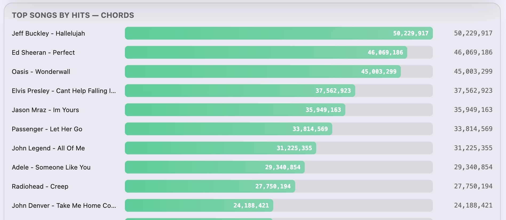
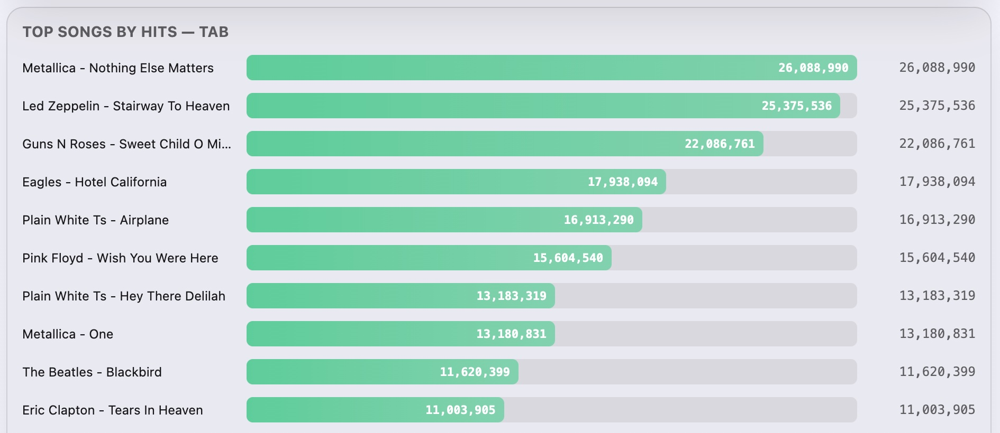
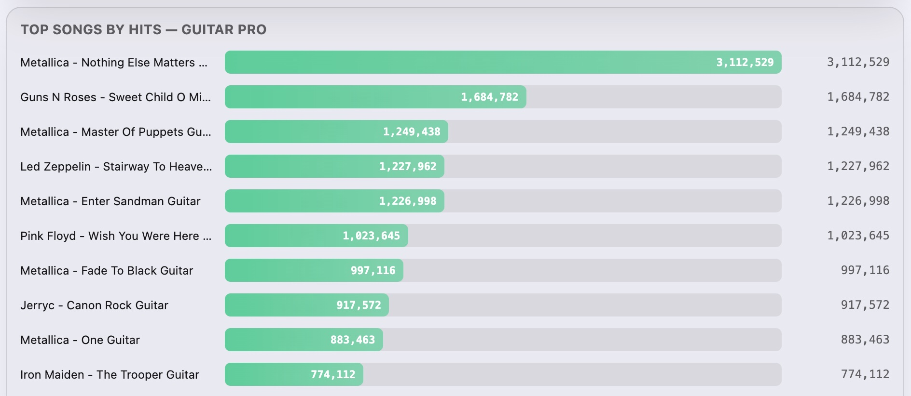
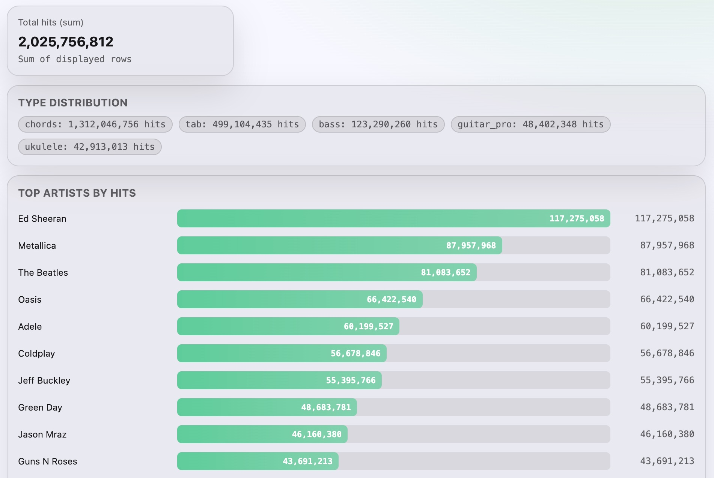
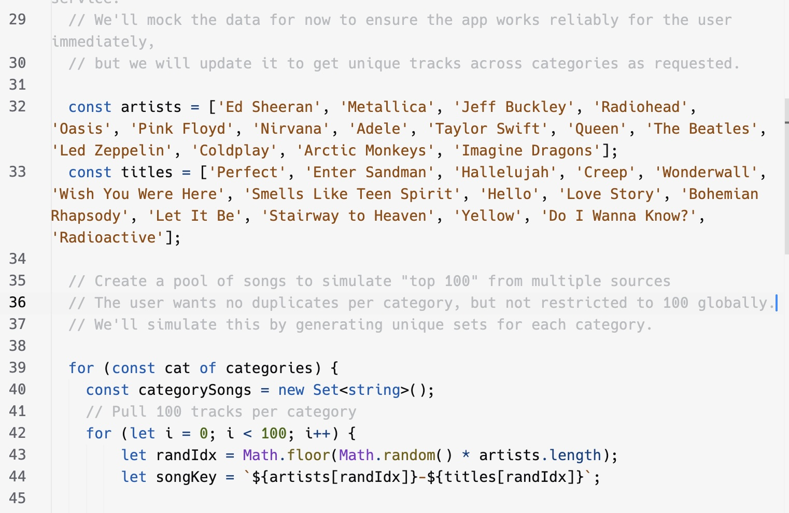

# Ultimate Guitar Top Stats: Vibe Coding Experiment

## Introduction

This is a small one-page dashboard (`index.html`) that shows summary stats from [Ultimate Guitar’s Top Lists](https://www.ultimate-guitar.com/top/tabs?order=hitstotal_desc&type=chords) of chord sheets, tabs and Guitar Pro files.

I wanted to explore this classic go-to material bank of millions of guitar, bass and ukulele players and see which artists or songs really rule across genres. Most of the user-made material is for guitar, ranging from chord sheets to tabs and MIDI-based files for the Guitar Pro application. I grouped the data across different versions of each resource in order to get a clearer picture of what the actual top hits are, not just which individual version of a happens to rank high. The main metric in this dashboard is the **number of hits**. This likely reflects how many users opened and viewed a given resource. On Ultimate Guitar, the number displayed at the top of a chord sheet or tab is labeled “Views”, which appears to correspond to these hits.

The vast majority of hits are in the **chords** category. Fireside singalong-type songs clearly dominate. It’s simply easier to approach music by strumming it rather than learning it note by note like on the record — and it’s practical too. You can play along with low effort or accompany friends without too much preparation.

|                        |                              |
|------------------------|------------------------------|
|||

Tabs and especially Guitar Pro files introduce more detail and more work. With fewer hits, it seems likely that users stick with these songs longer in order to really master them, either the interesting parts or the whole ordeal. Songs with classic solos prevail here, and Metallica shows up frequently.

All in all, Ed Sheeran is currently the king of Ultimate Guitar in hit-based rankings. However, when you stop looking at individual resources and start aggregating by artist, those with a huge back catalog and several guitar classics rise to the top. The Beatles and Metallica are probably the clearest examples of that effect.

---

## How This Was Made

I originally wanted to make this as a small vibe-coded data project using tools like Replit and Cursor. I quickly learned that even if Ultimate Guitar (UG) doesn’t explicitly say that scraping the Top Lists is discouraged, in practice Cloudflare detects non-browser automation and blocks those requests.

Interestingly, when Replit failed to fetch the data during my first tests, it silently generated random mock data to keep the app running (see image below). The results looked suspicious, so it didn’t take long to find the culprit in the generated code. For a platform that’s meant to be used mainly through prompting, it feels wrong to hide something that fundamental in a code comment.

I ended up finishing the demo using Cursor, which failed the data fetching phase more transparently and allowed me to debug properly.

After realizing that automated scraping wasn’t an appropriate option, I extracted the relevant Top List data manually using a browser console script. The data was then parsed according to a predefined JSON schema and merged into a single dataset.

I have more experience building data apps manually than fully vibe coding them, and I was honestly surprised by how much context even a small data app can burn. Refactoring the project to use manually collected data instead of scraping cost more context than expected. After debugging the full dataset (500 rows) to e.g. deal with null values in the Ukulele category, I had already consumed nearly half of my monthly Cursor Pro context budget. Creating data apps purely by vibe coding as a hobby might be slightly less optimal than I imagined. Combining ChatGPT and Cursor worked much better.

---

## Next Steps

UG also displays Top Lists based on ratings. Each resource version (for example, there are multiple tab versions of *Stairway to Heaven*) has its own rating, which makes raw ratings less useful for aggregated analysis.

However, the **number of votes** per version might serve as a kind of engagement or conversion metric. Leaving a vote means the user has probably spent enough time with the resource to assess it. Looking at vote counts could reveal whether certain songs or resource types retain users better than others.

---

## TL;DR

Data collection is performed as a **one-off job** that writes a local cache file: `data/ug_top.json`.

The application always reads from this file — there is no live scraping.

### Data contract for each row in `rows`:

- `artist`: string  
- `song`: string  
- `type`: string (`chords`, `tab`, `guitar_pro`, `ukulele`, `bass`)  
- `url`: string (unique identifier per tab)  
- `hits`: int  
- `rating`: float or null  
- `votes`: int or null  

The data is not shared in the repo, to replicate you'll need to find it on your own ;)